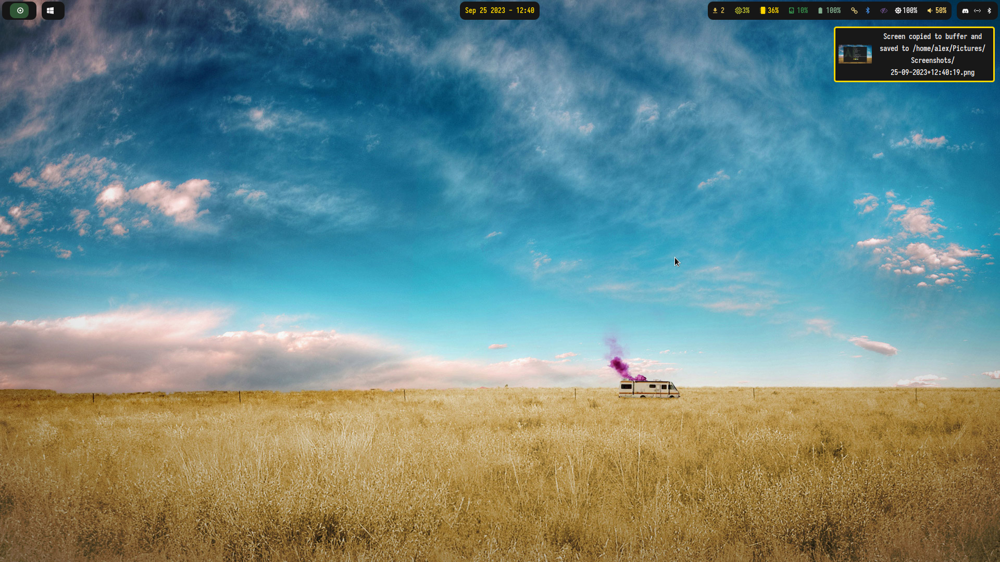
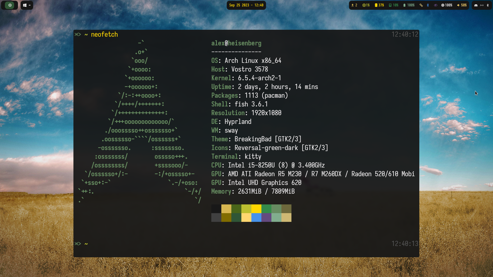

# Breaking Bad Hyprland Theme

> Glass Grade Theme!

> 99.1% Pure Rice!

<div align="center">




</div>

## Quickstart

For now check <https://github.com/hyprland-community/hyprtheme>

```console
mkdir -p ~/.config/hypr/themes
cd ~/.config/hypr/themes
git clone git@github.com:alexjercan/breakingbad-hyprland-theme.git breakingbad
hyprtheme enable breakingbad
```

## Dependencies

The applications you will need installed to be able to use the theme fully. The
theme will be applied only to these applications. (In case you don't have them
it will probably just skip them since it is a bash script)

* [dunst](https://github.com/dunst-project/dunst)
* [hyprland](https://github.com/hyprwm/Hyprland)
* [kitty](https://github.com/kovidgoyal/kitty)
* [rofi](https://github.com/davatorium/rofi)
* [swaylock](https://github.com/swaywm/swaylock)
* [waybar](https://github.com/Alexays/Waybar)
* [wlogout](https://github.com/ArtsyMacaw/wlogout)

## Future Plans

- [x] include an install script with all the apps
- [x] maybe also a GTK theme <https://github.com/alexjercan/breaking-bad-gtk>
